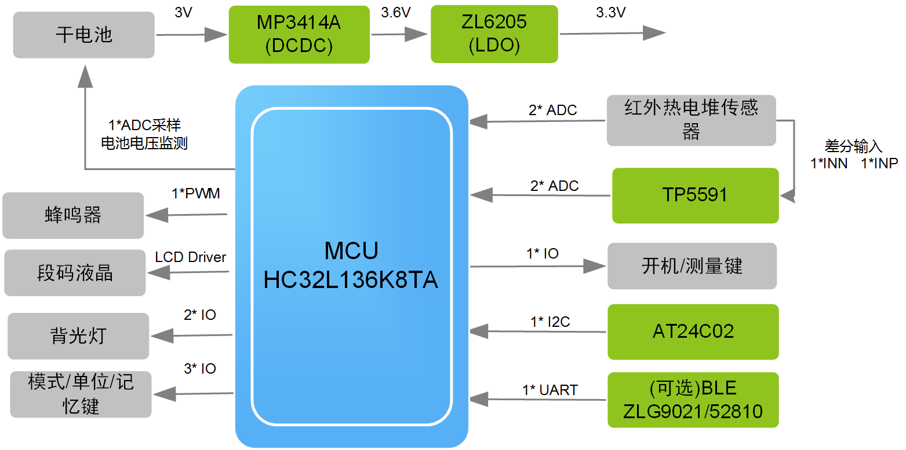

# AMetal_applictions示例使用说明

#### 项目介绍：

- ZLG_Thermometer_136：基于AMetal平台，采用主控芯片为华大HC32L136，支持多家模拟热电堆传感器接入，更换对应的RT和VT表即可。

#### 入门文档：

- docs/AMetal从入门到实践.pdf

####  ZLG_Thermometer_136使用方法：

1. 本示例依赖于AMetal框架的软件包，再下载本示例之后，需下载AMetal的软件包，AMetal获取链接为：https://gitee.com/zlgopen/ametal或https://github.com/zlgopen/ametal

2. 将 ZLG_Thermometer_136放到下载的AMetal包的\board\aml13x_core 路径下

3. 打开工程编译，编译之后即可下载，需配套我司提供的硬件

> AMetal包中\board\aml13x_core\project_example\project_keil5工程 是HC32L13x系列芯片的外设示例，以及包含各种组件的使用
>
> 更详细的使用方法，请参考入门文档

#### 应用方案框图：

